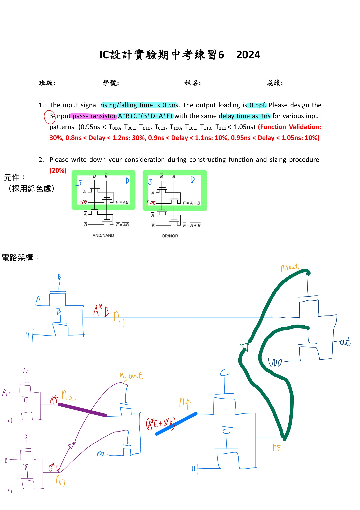
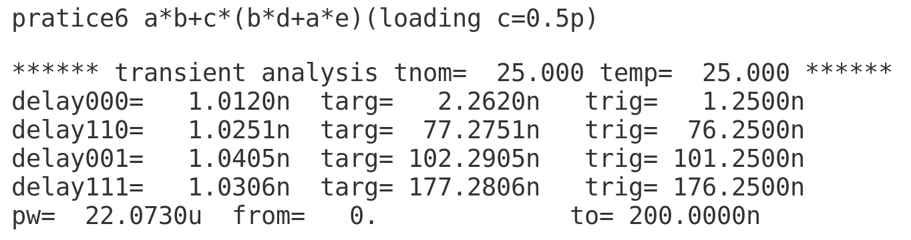
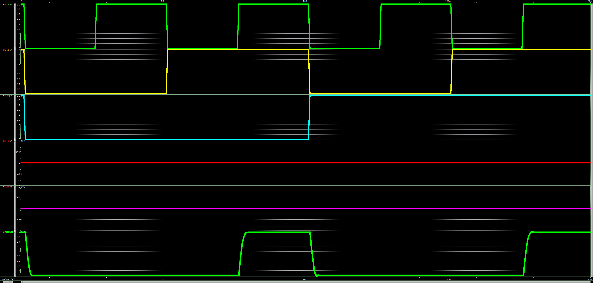

# 112-2-IC-Design-Lab Practice 6

- 可參考Lab3
- 備註:
    - delay time全部符合
    - 此題僅要求 3-input，故僅a,b,c有週期變化，d,e則無週期變化(題目無特別要求應該如何設計pattern，故請讀者安心使用)。
    - p6_Not_Recommended.sp 為a,b,c,d,e皆有週期變化，故將會有16個delay需要調整(若有人調整成功，還請聯繫作者)。
- 題目與節點
    >
- delay time
    >
- 波型
    >
