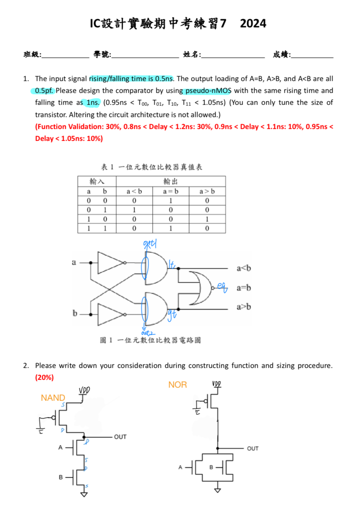
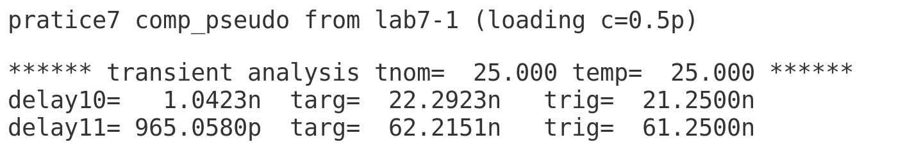
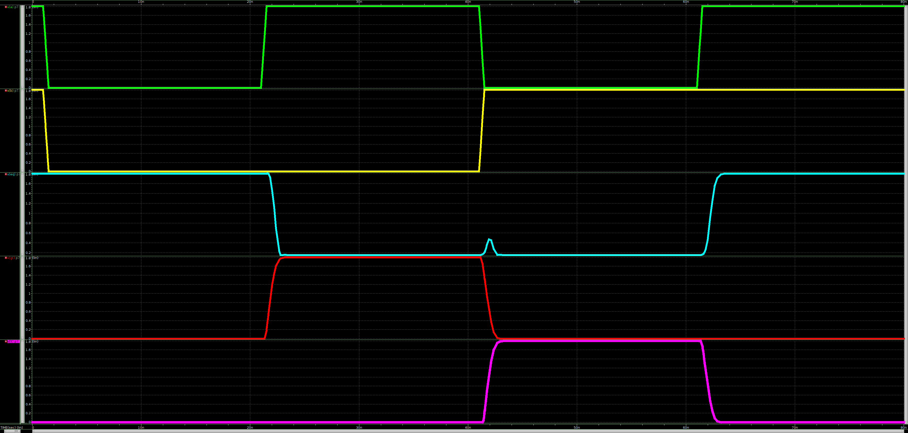

# 112-2-IC-Design-Lab Practice 7

- 可參考Lab7
- 備註: 
    - 突波是可以接受的。
    - 助教:「需要測量 a<b , a=b , a>b 之delay time」。
    - p7_eq.sp 僅測量 a=b 之 delay time 。
    - p7_ee.sp 僅供參考。(為電機系同學提供，其**inverter 也是pseudo-nMOS**，delay time全部符合，但**有更改電路結構，不符合題目要求**)
- 題目與節點
    >
- delay time
    >　p7.sp
    > 
    > p7_eq.sp
    > 　
- 波型
    > p7.sp
    > 
    > p7_eq.sp
    > 
