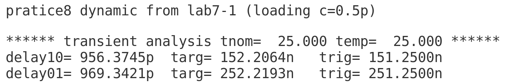
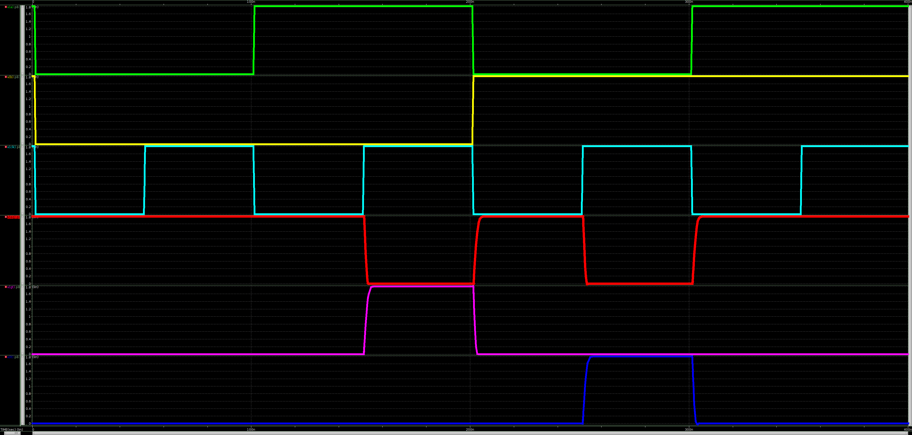

# 112-2-IC-Design-Lab Practice 8 動態電路

- 可參考 Lab7 與 Lab5
- 備註: 
    - delay time全部符合
    - 助教:「需要測量 a<b , a=b , a>b 之delay time 」
    - p8_eq.sp 僅測量 a=b 之 delay time 
- 題目與節點
    >
- delay time
    >　p8.sp
    > 
    > p8_eq.sp
    > 　
- 波型
    > p8.sp
    > 
    > p8_eq.sp
    > 