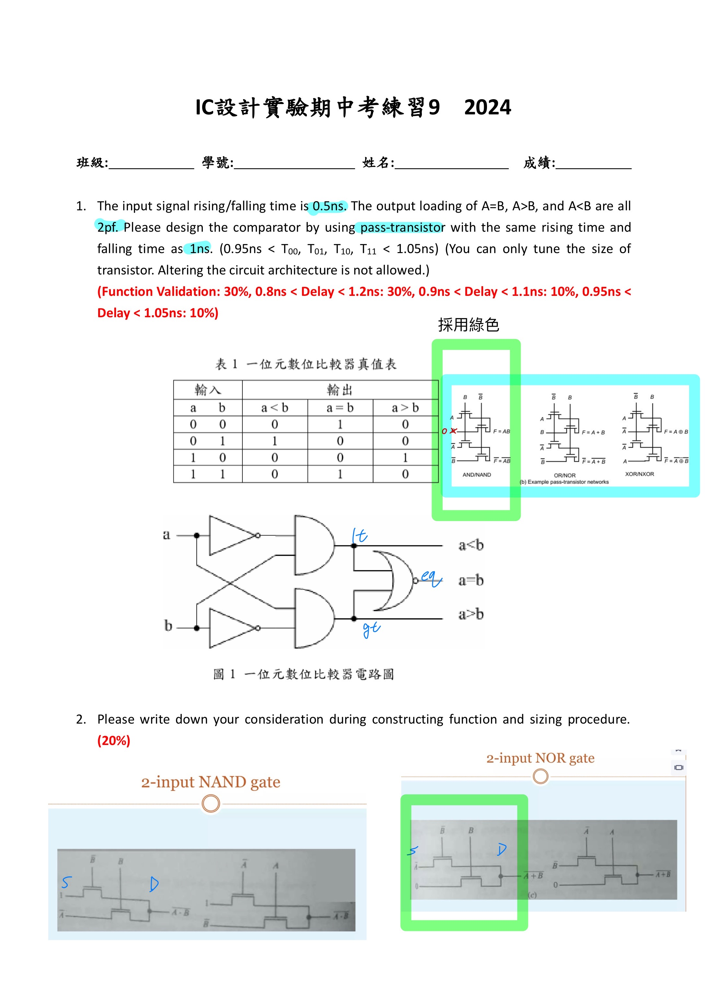
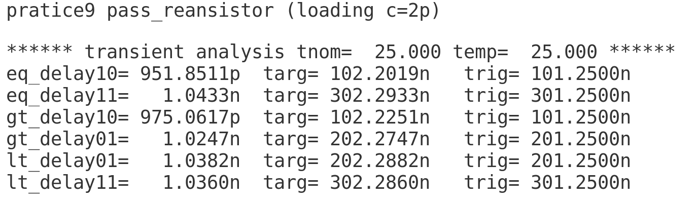
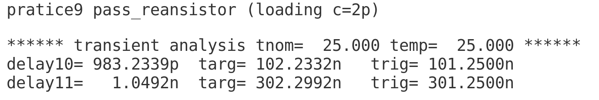
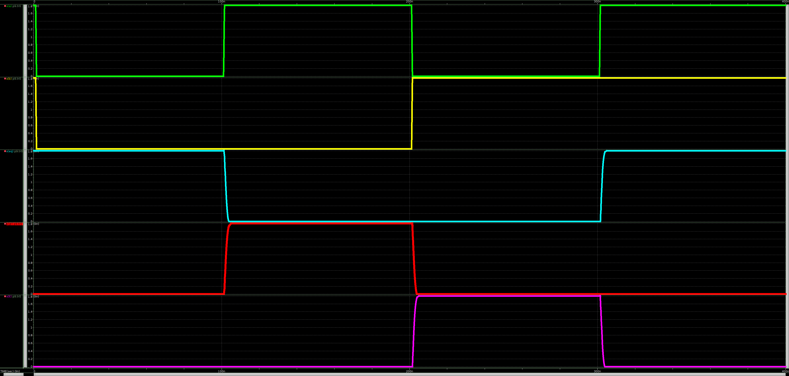
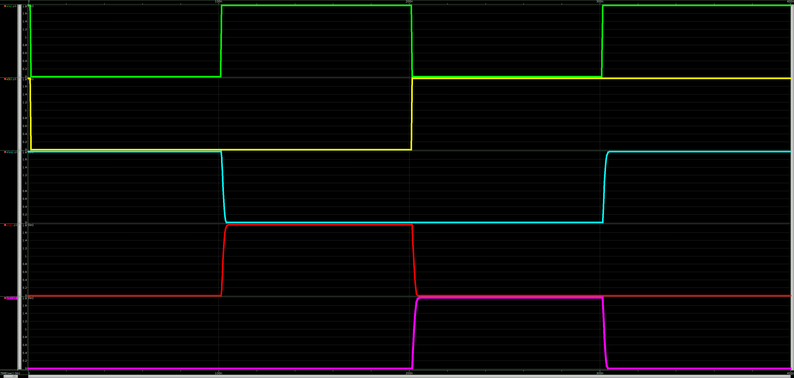

# 112-2-IC-Design-Lab Practice 9

- 可參考 Lab7 與 Lab3
- 備註: 
    - delay time全部符合
    - 助教:「需要測量 a<b , a=b , a>b 之delay time 」
    - p9_eq.sp 為僅測量 a=b 之 delay time 
  
- 題目與節點
    >
- delay time
    >　p9.sp
    > 
    > p9_eq.sp
    > 　
- 波型
    > p9.sp
    > 
    > p9_eq.sp
    > 
