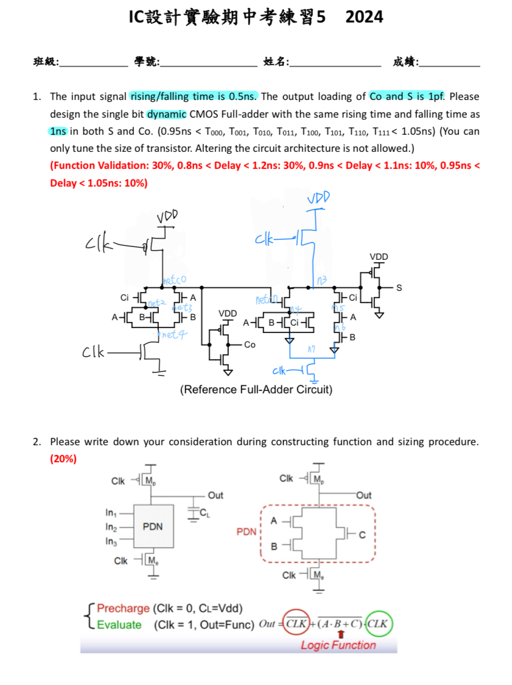
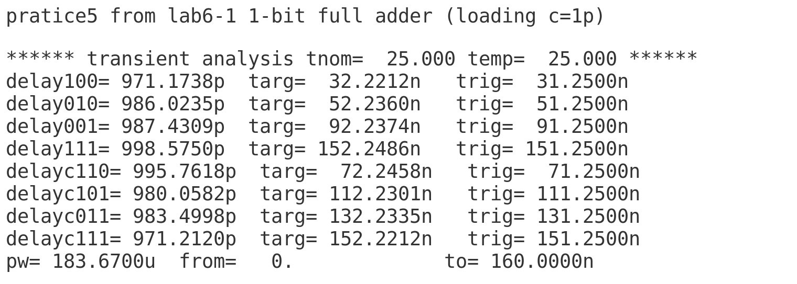
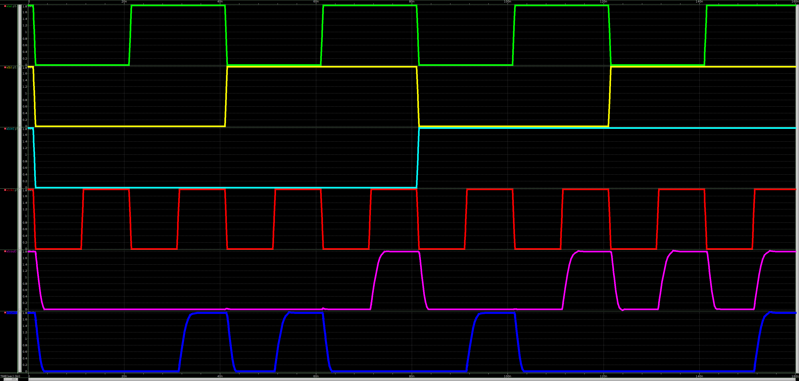

# 112-2-IC-Design-Lab Practice5

- 可參考 Lab6-1 與 Lab5
- delay time 全部符合
- **注意:**
  
  *VCLK    CLK  GND    PULSE(VL  VH  delay  trise  tfall  pulse_width  period)

    vclk clk 0   pulse(1.8  0   1n  0.5n  0.5n  9.5n   20n)

    tfall+pulse_width=period/2

    即0.5n+9.5n=10n
- 題目與節點
    > 
- delay time
    > 
- 波型
    > 
